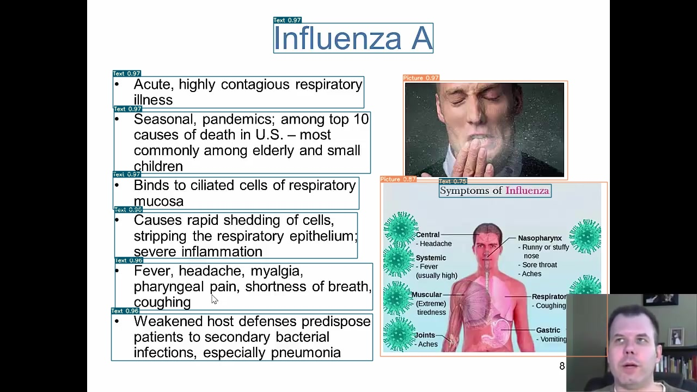

# OSS-Layout-Detection
## Abstract
온라인 강의가 공간적, 시간적 한계점을 극복하는 수단으로서 꾸준히 성장함에 따라 학습자의 효율적인 학습을 위하여 강의 영상 내 특정 컨텐츠에 접근이 가능하도록 영상 내 검색 및 인덱싱 생성과 관련된 다양한 시스템이 제안되었다. 이러한 기술은 강의 영상 내 문자 및 시각 자료의 레이아웃을 자동 탐지하는 기술을 필요로 한다. 

따라서, 본 프로젝트에서는 온라인 강의 영상 내 text 및 visual 기반 자료(문자, 수식, 그림, 표)를 탐지하는 기술을 제안한다. 강의 영상 컨텐츠의 레이아웃 인식을 위하여 YOLOv7 모델을 사용하였고, 여러 문서 레이아웃 데이터셋 (DocLayNet, LectureBank, MLPDataset)과 실험을 통해 성능을 평가하였다. 실험 결과, 유사한 도메인의 데이터셋인 DocLayNet 으로 사전학습한 네트워크를 기반으로 전이학습을 진행한 모델의 mAP 는 0.73 로 가장 높은 성능을 보였다.

<br><br>

## Installation
```shell
git clone https://github.com/WongKinYiu/yolov7
cd yolov7
pip install -r requirements.txt
```

<br><br>

## Data
[DocLayNet](https://github.com/DS4SD/DocLayNet)은 PDF 문서 이미지와 문서의 각 페이지에 대해 수동으로 생성된 문서 레이아웃 주석 데이터를 제공한다. 
PDF 문서와 강의 슬라이드는 문자 및 시각 자료로 구성되어 있다는 점은 동일하지만, PDF 문서의 경우 footnote, page-footer, page-header 등 강의 슬라이드와 구조적인 차이를 보인다. 따라서 기존 DocLayNet 데이터셋의 11개 클래스를 4개의 클래스(Formula, Picture, Table, Text)로 병합 및 분할하여 사용한다. 
<br><br>
이러한 구조적 차이 외에도 온라인 강의에서 활용되는 슬라이드의 경우, PDF 문서와 화면 비율이 다르며, 교수자에 따라 슬라이드의 형식이 달라지기 때문에 레이아웃의 가변성이 높다. 따라서 이러한 차이점을 보완하기 위하여 강의 슬라이드 이미지 데이터 세트인 [LectureBank](https://github.com/Yale-LILY/LectureBank)와 [MLPDataset](https://github.com/dondongwon/MLPDataset)을 활용하였다. 
<br><br>
두 데이터셋은 speech-to-text와 OCR과 같은 자연어처리를 기반으로 추출한 강의 스크립트 및 텍스트 정보만을 제공하기 때문에 강의 자료 내 컨텐츠 레이아웃에 대한 주석 데이터가 포함되어 있지 않다. 그러므로 Lecture Bank에서 300장, MLP Dataset에서 192장을 랜덤하게 추출하고, [Roboflow](https://roboflow.com/)를 활용하여 각 강의 슬라이드 내 컨텐츠의 레이아웃에 대한 주석 데이터를 생성하였다.

<br><br>


## Model Training
레이아웃 인식을 위해 딥러닝 기반 Object Detection 네트워크인 YOLO 시리즈 중 2022년 제안된 [YOLOv7](https://github.com/WongKinYiu/yolov7)을 사용하였다. 강의 슬라이드 이미지 데이터의 경우, 모델 학습을 위하여 LectureBank 데이터 300장을 Train 240, Validation 60장으로 분할하여 사용하였고, MLPDataset 데이터 192장은 모델의 성능 평가에 활용하였다. 

```shell
python train.py --workers 4 --device 0 --batch-size 32 --data data/[data].yaml --img 640 640 --cfg cfg/training/[custom].yaml --weights '[pretrained_weight].pt' --name [name] --hyp data/[hyp.custom].yaml
```

<br><br>


## Performance

### Test
사전 학습과 실제 학습에 사용된 데이터에 따른 탐지 성능을 비교평가 하였으며, 각 실험의 평가 지표로 mAP@.5:.95를 사용하였다. 

```shell
python test.py --data data/[data].yaml --img 640 --batch 32 --conf 0.001 --iou 0.65 --device 0 --weights [check-point].pt --name [name]
```

|   Train Data    |    Pretrained Data     |      mAP@.5:.95         | model | 
|:---------------:|:----------------------:|:-----------------------:|:-----:|
|    DocLayNet    |          COCO          |          0.526          |   -   |
| LectureBank 300 | -<br>COCO<br>DocLayNet | 0.425<br>0.522<br>0.743 |   -   |
| LectureBank 837 |       DocLayNet        |          0.763          | [best_ckpt](https://drive.google.com/file/d/1n3huEmsJ4n59U6jfhWci2sZQjTgKZDQl/view?usp=share_link) |


대규모 데이터셋인 COCO로 사전 학습된 모델을 사용하여 LectureBank를 학습한 경우, scratch로 학습하였을 때 대비 각각 22.8%의 성능 향상을 보였다. 또한, LectureBank로 학습할 때, 여러 일상 이미지들의 집합인 COCO 와 달리 문서 이미지 내 컨텐츠의 레이아웃이라는 공통점을 지닌 DocLayNet으로 학습된 모델을 사전학습 모델로 사용한 경우, 0.73으로 가장 높은 성능을 보였다.

또, 훈련에 사용할 데이터의 규모를 늘리기 위하여 LectureBank에서 527장을 추가적으로 추출한 후 semi-supervised learning 기법 중 하나인Pseudo labeling을 적용하여 학습을 진행하였다. Pseudo labeling은 정답 레이블이 존재하는 데이터로 충분히 학습된 모델의 예측 값을 기반으로 unlabeled 데이터에 확률적인 정답 레이블을 부여하는 기법이다. 

본 프로젝트에서는 mAP 0.743으로 가장 좋은 성능을 보였던 DocLayNet->LectureBank 모델의 예측 결과를 기반으로 527장의 이미지에 대한 Pseudo-label을 생성하였고, 정확도를 높이기 위하여 해당 label을 수동으로 수정하는 후보정하였다. 표의 마지막 행은 이러한 방식으로 생성한 데이터와 기존의 데이터를 합하여 학습한 모델의 test 결과를 나타낸다. 표에서 확인할 수 있듯이, mAP 0.763으로 기존 300장으로 학습하였을 때 대비 2.6%의 성능 향상을 보였다.


<br><br>


## Detect Layout
```shell 
python detect.py --weights best_ckpt.pt --conf 0.25 --img-size 640 --source [your_data]
```



## Demo Links 
[](https://colab.research.google.com/drive/12EqWaKcx2D7zapCZFdOlzlPEGjwvMAlr?usp=sharing)


<br><br>

## Reference
YOLOv7 : <https://github.com/WongKinYiu/yolov7>
DocLayNet : <https://github.com/DS4SD/DocLayNet>
LectureBank : <https://github.com/Yale-LILY/LectureBank>
MLPDataset : <https://github.com/dondongwon/MLPDataset>

